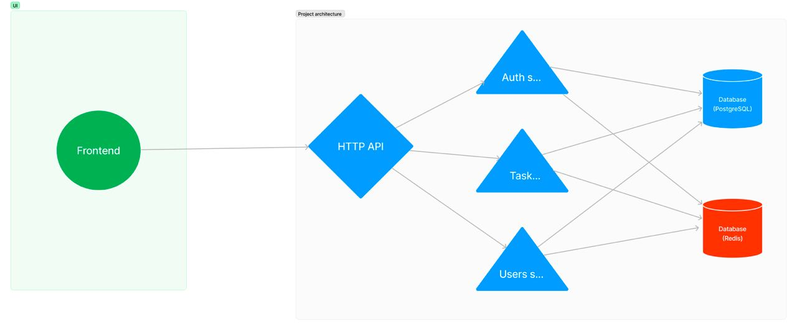

## Project Architecture
  
# Help to grow and improve skills
### Direction: Artificial Intelligence Technologies
### Case:  Training and Development in Professional Skills of Job Selection
This service will be a part of platform ___investideas.uz___ give a chance to learn professional skill from Senior Developers (Mentors).

This service called __"Grow-Together"__.
__"Grow-Together"__ is a groundbreaking platform dedicated to fostering knowledge sharing and mentorship within the programming community. It's a dynamic ecosystem where junior developers can learn from seasoned professionals, and seniors can offer code reviews and earn compensation. Our platform also incorporates advanced AI matching algorithms to pair mentors (senior developers) with mentees based on their preferred programming stacks.

__Key Features:__

___Mentor-Mentee Matching:___ "Grow-Together" utilizes cutting-edge AI algorithms to match aspiring junior developers with experienced senior mentors. The matching process takes into account programming stacks, skill levels, and individual learning goals to create meaningful mentor-mentee connections.

___Code Review and Feedback:___ Senior developers can leverage the platform to provide in-depth code reviews and constructive feedback to junior developers. This feedback loop is instrumental in helping juniors improve their coding skills and make informed progress.

___Skill Development:___ Junior developers can engage in one-on-one or group mentoring sessions, covering topics ranging from coding best practices to project guidance. This hands-on learning approach allows juniors to accelerate their skill development under the guidance of industry experts.

___Monetary Incentives:___ "Grow-Together" introduces a unique compensation model, where senior mentors receive compensation for their code review and mentoring services. This financial incentive ensures the active participation of experienced developers and encourages knowledge sharing.

___Project Collaboration:___ The platform doubles as an incubator for innovative coding projects. "Grow-Together" releases coding ideas with a plethora of tasks to be implemented. Both mentors and mentees can collaborate on these real-world projects, fostering practical application of knowledge and experience.

___Community Interaction:___ A thriving community forum allows users to engage in discussions, ask questions, and share insights. This open dialogue not only builds a supportive community but also facilitates knowledge exchange beyond mentorship.

___Learning Resources:___ The platform offers a wealth of learning resources, including tutorials, coding challenges, and reference materials, to supplement the learning journey for juniors.

___Skill Badges:___ As juniors achieve specific milestones, they can earn skill badges that serve as a testament to their growing proficiency in their chosen programming stacks. This gamification element adds an extra layer of motivation to the learning process.

___Data Privacy:___ "Grow-Together" takes data privacy and security seriously, employing robust measures to protect user information and ensure a safe and confidential learning environment.

__"Grow-Together"__ is more than just a mentorship platform; it's a vibrant ecosystem where the future of coding is nurtured, and innovative projects come to life. Whether you're a junior developer seeking guidance or a senior developer eager to share your expertise and earn from it, "Grow-Together" is your pathway to growth, collaboration, and success in the coding world. Join our community and invest in your future today!

 